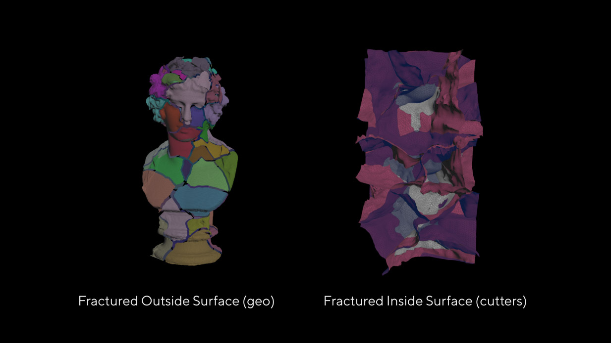
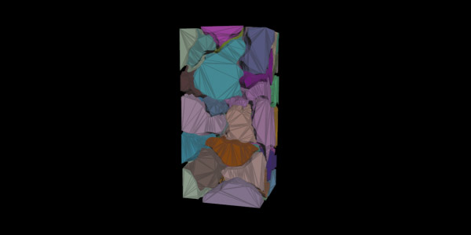
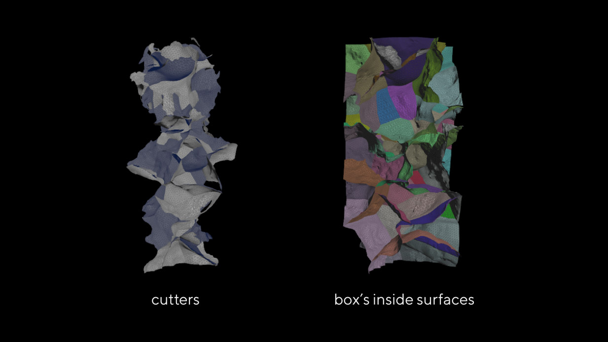
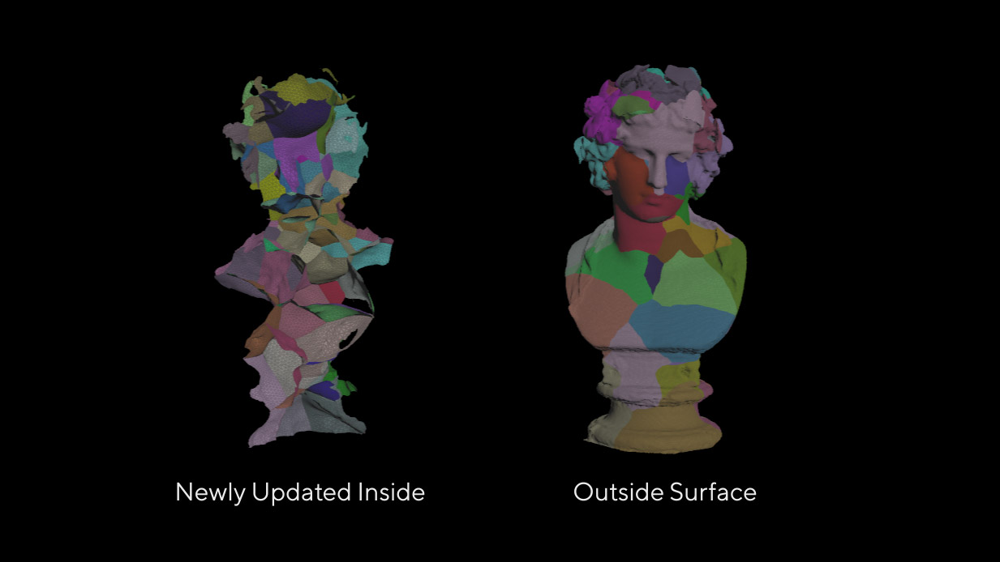
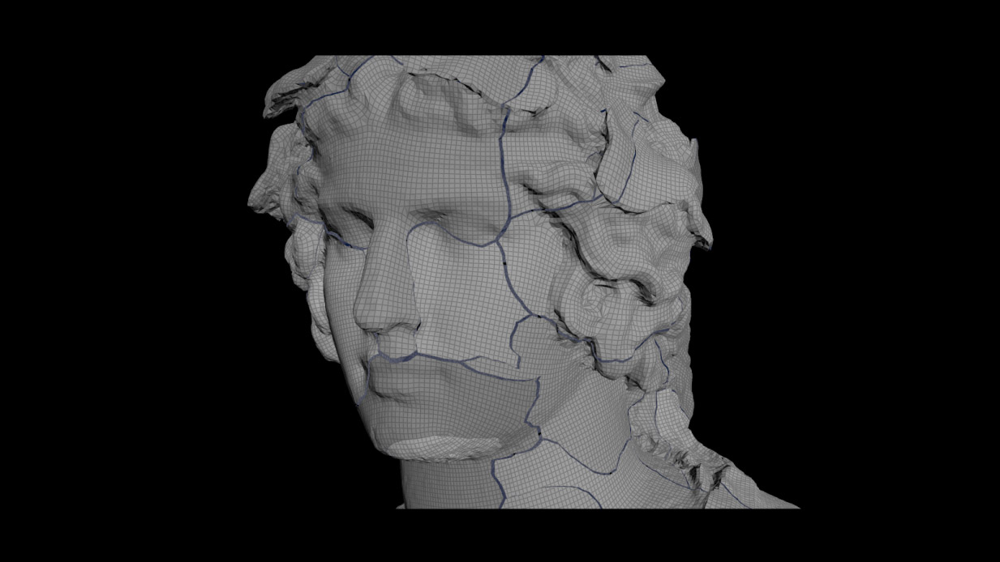
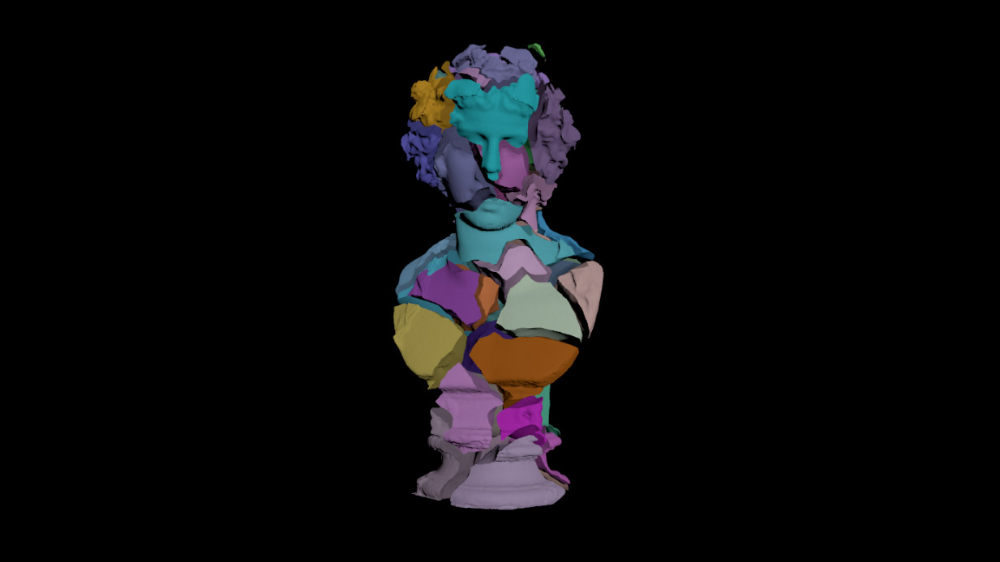
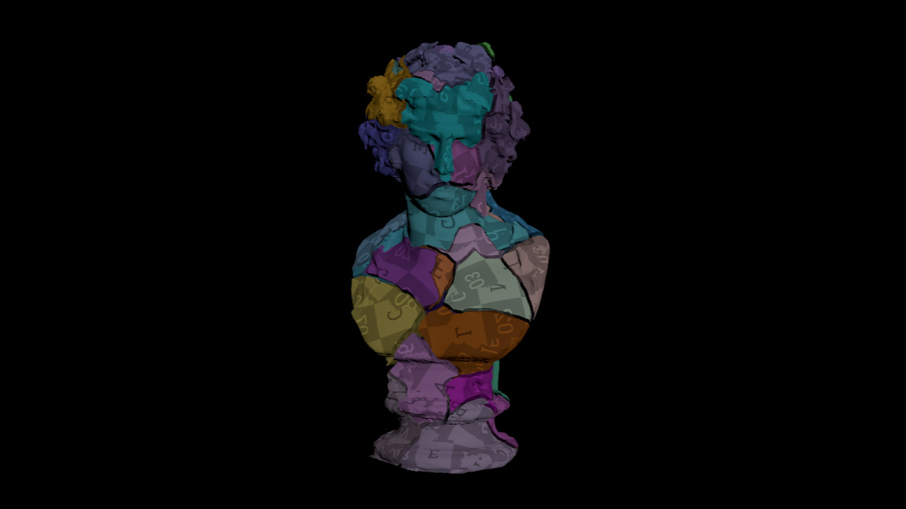

# Shatterizer
A collection of Houdini nodes for shattering geometry, offering a more stable alternative to the **Boolean Fracture SOP** and **Boolean SOP (Shatter)**.

- **Shatterizer**: An enhanced version of the Boolean Fracture node. It allows for more consistent fracturing of geometry with fewer artifacts.
- **RBD Fracture**: A simplified version of the RBD Material Fracture node, but with the Shatterizer built in. It allows for generating cutting geometries and fracturing objects using either the Shatterizer or a basic Voronoi Fracture.

You can see how the nodes work within the provided . The file includes descriptions of the node parameters for better understanding.
  

# How the Shatterizer Works Internally?

The main goal of the Shatterizer node is to fracture the original geometry without remeshing or altering its initial topology.

**Boolean Operation with Surface Mode**:   
The node uses the **Boolean SOP**, treating both the geometry and the cutters as surfaces. In **surface mode**, Boolean operations are highly precise and stable, but they don't generate an internal structure. As a result, only the surfaces of the original geometry and the cutters are fractured.   

**Generating Inside Pieces**:   
Inside pieces are created using simple geometry, such as a **bounding box**, and another Boolean operation. The Boolean node handles simple geometries like boxes very well, which allows for the generation of basic inside pieces.   

**Matching Cutter Surface with Inside Pieces**:   
The cutter surface is matched with the inside pieces of the fractured box. The piece numbers are transferred to the cutters. The cutter surfaces are then duplicated for each piece, and winding information is transferred.   

**Matching Inside and Outside Surfaces**:   
The next step is to match the newly generated inside surfaces with the original outside surfaces. This is done by **comparing the edges** of the surfaces. The node provides three matching methods: **Winding Compare**, **Intersection ID**, and **Edge Compare**. The most precise methods are **Winding Compare** and **Intersection ID**.   

**Detriangulation**:   
Both inside and outside surfaces can be **detriangulated**. This is done either using the **Dissolve SOP** or a **custom method**.   

**Fusing Inside and Outside Surfaces**:   
Once a match between the inside and outside surfaces is found, they are fused together.   

**Post-Processing**:   
After the fusion, the generated pieces are post-processed to fill any holes, interpolate initial attributes, and perform other cleanup tasks.   

